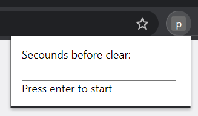

# plsdeletemyhistory
An alternative to https://github.com/0x0elliot/plsdeletemyhistory using a browser extension.

By default this removes
- protectedWeb
- appcache
- cache
- cacheStorage
- cookies
- downloads
- fileSystems
- formData
- history
- indexedDB
- localStorage
- passwords
- serviceWorkers
- webSQL
